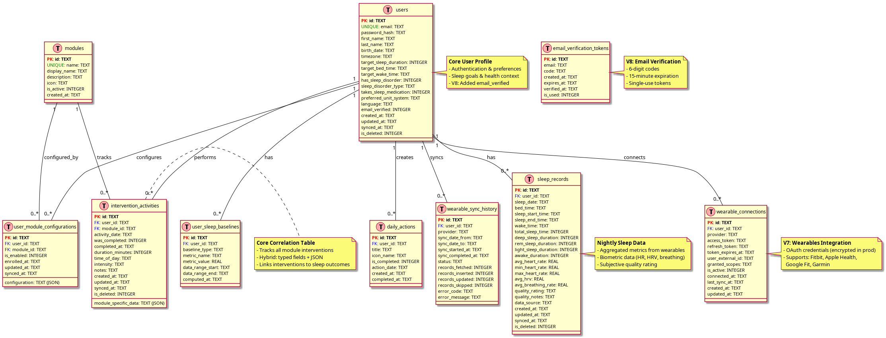

# Database Design

This document describes the database architecture for SleepBalance, including schema design, implementation approach, and migration strategy.

## Overview

**Database Type:** SQLite (local-first) → PostgreSQL (future backend sync)
**Design Pattern:** Hybrid approach (typed columns + JSON flexibility)
**Architecture:** Local-first with offline-first capabilities
**Current Version:** 8

### Schema Diagram



*Complete database schema showing all tables and relationships. [View PlantUML source](./schema_v8.puml)*

## Design Philosophy

### Hybrid Schema Approach

We use a **hybrid design** that combines:
- **Typed columns** for common, frequently-queried attributes
- **JSON fields** for module-specific, flexible data

**Why hybrid?**
- ✅ Type safety and performance for common queries
- ✅ Flexibility to add new modules without schema changes
- ✅ Easy migration from SQLite to PostgreSQL
- ✅ Simpler sync logic (JSON eliminates schema versioning issues)

### Local-First Architecture

**Key Principles:**
- User data lives on device first
- Offline-capable by default
- UUIDs for distributed ID generation
- Sync queue for eventual backend consistency
- Soft deletes for sync reliability

## Core Tables

### 1. Users Table

Stores user profiles and sleep preferences.

```sql
CREATE TABLE users (
  id TEXT PRIMARY KEY,                    -- UUID
  email TEXT UNIQUE NOT NULL,
  password_hash TEXT,
  first_name TEXT NOT NULL,
  last_name TEXT NOT NULL,
  birth_date DATE NOT NULL,

  -- Sleep context
  timezone TEXT NOT NULL,                 -- IANA timezone (e.g., 'America/New_York')
  target_sleep_duration INTEGER,          -- minutes (e.g., 480 = 8 hours)
  target_bed_time TEXT,                   -- HH:mm format (e.g., '22:30')
  target_wake_time TEXT,                  -- HH:mm format (e.g., '06:30')

  -- Health context (for analysis)
  has_sleep_disorder BOOLEAN DEFAULT FALSE,
  sleep_disorder_type TEXT,               -- 'insomnia', 'sleep_apnea', etc.
  takes_sleep_medication BOOLEAN DEFAULT FALSE,

  -- Preferences
  preferred_unit_system TEXT DEFAULT 'metric',  -- 'metric' or 'imperial'
  language TEXT DEFAULT 'en',             -- 'en', 'de', etc.

  -- Authentication (added in V8)
  email_verified BOOLEAN DEFAULT FALSE,   -- Email verification status

  -- Sync metadata
  created_at TIMESTAMP DEFAULT CURRENT_TIMESTAMP,
  updated_at TIMESTAMP DEFAULT CURRENT_TIMESTAMP,
  synced_at TIMESTAMP,                    -- NULL = not yet synced
  is_deleted BOOLEAN DEFAULT FALSE        -- Soft delete for sync
);
```

**Key Fields:**
- `timezone`: Critical for sleep timing calculations (users may travel)
- `target_*`: User's sleep goals, used for comparisons
- `has_sleep_disorder`: Context for analysis (users with disorders have different baselines)

---

### 2. Sleep Records Table

Stores nightly sleep data from wearables (aggregated metrics).

```sql
CREATE TABLE sleep_records (
  id TEXT PRIMARY KEY,                    -- UUID
  user_id TEXT NOT NULL,
  sleep_date DATE NOT NULL,               -- The night (e.g., 2025-10-29)

  -- Sleep timing
  bed_time TIMESTAMP,                     -- When user went to bed
  sleep_start_time TIMESTAMP,             -- When user fell asleep (sleep onset)
  sleep_end_time TIMESTAMP,               -- When user woke up
  wake_time TIMESTAMP,                    -- When user got out of bed

  -- Sleep phase durations (in minutes) - AGGREGATED
  total_sleep_time INTEGER,               -- Total time asleep
  deep_sleep_duration INTEGER,
  rem_sleep_duration INTEGER,
  light_sleep_duration INTEGER,
  awake_duration INTEGER,                 -- Awake time during the night

  -- Biometric data (nightly averages)
  avg_heart_rate REAL,                    -- bpm
  min_heart_rate REAL,
  max_heart_rate REAL,
  avg_hrv REAL,                           -- Heart Rate Variability (RMSSD in ms)
  avg_breathing_rate REAL,                -- breaths per minute

  -- Subjective quality (user input)
  quality_rating TEXT CHECK(quality_rating IN ('bad', 'average', 'good')),
  quality_notes TEXT,                     -- Optional user notes

  -- Metadata
  data_source TEXT,                       -- 'apple_health', 'google_fit', 'manual', etc.
  created_at TIMESTAMP DEFAULT CURRENT_TIMESTAMP,
  updated_at TIMESTAMP DEFAULT CURRENT_TIMESTAMP,
  synced_at TIMESTAMP,
  is_deleted BOOLEAN DEFAULT FALSE,

  FOREIGN KEY (user_id) REFERENCES users(id) ON DELETE CASCADE,
  UNIQUE(user_id, sleep_date)             -- One sleep record per night per user
);

CREATE INDEX idx_sleep_records_user_date ON sleep_records(user_id, sleep_date);
CREATE INDEX idx_sleep_records_quality ON sleep_records(user_id, quality_rating);
```

**Important Notes:**
- **Aggregated data only** for now (total deep sleep, not minute-by-minute)
- **Future**: Add `sleep_stages_timeseries` table for fine-grained data
- `quality_rating`: User's subjective feeling (nullable - optional input)
- `data_source`: Track where data came from (useful for debugging/quality checks)

**Design Decision:** Why aggregates first?
- Simpler queries for UI (no need to sum time-series data)
- Faster performance (aggregates are pre-calculated)
- Can add granular data later without breaking existing code

---

### 3. Modules Table

Defines available intervention modules.

```sql
CREATE TABLE modules (
  id TEXT PRIMARY KEY,                    -- e.g., 'light', 'sport', 'meditation'
  name TEXT UNIQUE NOT NULL,              -- Internal name
  display_name TEXT NOT NULL,             -- e.g., 'Light Therapy'
  description TEXT,
  icon TEXT,                              -- Icon identifier (legacy)
  is_active BOOLEAN DEFAULT TRUE,         -- Can disable modules app-wide
  created_at TIMESTAMP DEFAULT CURRENT_TIMESTAMP
);

-- Pre-populated with 9 modules in migration_v1.dart
```

**IMPORTANT (PHASE 7 Update):** Module metadata (icons, colors, descriptions) is now **hardcoded** in `lib/modules/shared/constants/module_metadata.dart` for better type safety and compile-time guarantees. The modules table remains for foreign key relationships but metadata queries use the hardcoded `ModuleMetadata` map.

---

### 4. User Module Configurations Table

Stores each user's module settings.

```sql
CREATE TABLE user_module_configurations (
  id TEXT PRIMARY KEY,                    -- UUID
  user_id TEXT NOT NULL,
  module_id TEXT NOT NULL,
  is_enabled BOOLEAN DEFAULT TRUE,        -- User has enabled this module

  -- Module-specific configuration (JSON)
  -- Example for Light module:
  -- {
  --   "target_time": "07:30",
  --   "target_duration_minutes": 30,
  --   "preferred_light_type": "natural_sunlight",
  --   "notifications": {
  --     "morning_reminder": {"enabled": true, "time": "07:00"},
  --     "evening_dim_reminder": {"enabled": true, "time": "20:00"},
  --     "blue_blocker_reminder": {"enabled": true, "time": "21:00"}
  --   }
  -- }
  configuration JSON,

  enrolled_at TIMESTAMP DEFAULT CURRENT_TIMESTAMP,
  updated_at TIMESTAMP DEFAULT CURRENT_TIMESTAMP,
  synced_at TIMESTAMP,

  FOREIGN KEY (user_id) REFERENCES users(id) ON DELETE CASCADE,
  FOREIGN KEY (module_id) REFERENCES modules(id) ON DELETE CASCADE,
  UNIQUE(user_id, module_id)              -- One config per user per module
);

CREATE INDEX idx_user_modules_user ON user_module_configurations(user_id);
```

**Why JSON for configuration?**
- Each module has different settings (light has "light_type", sport has "exercise_type")
- Avoids creating 9 separate configuration tables
- Easy to add new configuration options without migrations
- Notification settings are complex nested objects (perfect for JSON)

---

### 5. Intervention Activities Table

**This is the core correlation table.** Stores daily intervention tracking.

```sql
CREATE TABLE intervention_activities (
  id TEXT PRIMARY KEY,                    -- UUID
  user_id TEXT NOT NULL,
  module_id TEXT NOT NULL,
  activity_date DATE NOT NULL,            -- The day the intervention was performed

  -- Completion tracking
  was_completed BOOLEAN NOT NULL,         -- Did the user do it? (required)
  completed_at TIMESTAMP,                 -- When specifically (optional)

  -- Common typed fields (present for most modules)
  duration_minutes INTEGER,               -- How long (almost all modules have duration)
  time_of_day TEXT CHECK(time_of_day IN ('morning', 'afternoon', 'evening', 'night')),
  intensity TEXT CHECK(intensity IN ('low', 'medium', 'high')),

  -- Module-specific flexible data (JSON)
  -- Example for Light module:
  -- {
  --   "light_type": "natural_sunlight",
  --   "location": "outdoor",
  --   "weather": "sunny"
  -- }
  module_specific_data JSON,

  -- Notes
  notes TEXT,

  created_at TIMESTAMP DEFAULT CURRENT_TIMESTAMP,
  updated_at TIMESTAMP DEFAULT CURRENT_TIMESTAMP,
  synced_at TIMESTAMP,
  is_deleted BOOLEAN DEFAULT FALSE,

  FOREIGN KEY (user_id) REFERENCES users(id) ON DELETE CASCADE,
  FOREIGN KEY (module_id) REFERENCES modules(id) ON DELETE CASCADE
);

CREATE INDEX idx_intervention_activities_user_date ON intervention_activities(user_id, activity_date);
CREATE INDEX idx_intervention_activities_module ON intervention_activities(module_id, activity_date);
CREATE INDEX idx_intervention_activities_completion ON intervention_activities(user_id, was_completed);
```

**Key Design Decisions:**

1. **`was_completed` is required**: Binary yes/no tracking (essential for correlation)
2. **Common typed fields**: duration, time_of_day, intensity are extracted because they're common across modules
3. **`module_specific_data` JSON**: Flexible storage for module-unique attributes
4. **`activity_date` is DATE**: Interventions are day-level (not timestamp) for easier correlation

**Why this works for correlation:**
```sql
-- Example: Get sleep quality vs light therapy adherence
SELECT
  sr.sleep_date,
  sr.quality_rating,
  sr.deep_sleep_duration,
  ia.was_completed as did_light_therapy,
  ia.duration_minutes as light_duration
FROM sleep_records sr
LEFT JOIN intervention_activities ia
  ON ia.user_id = sr.user_id
  AND ia.activity_date = sr.sleep_date    -- Intervention on same day as sleep
  AND ia.module_id = 'light'
WHERE sr.user_id = 'user123'
  AND sr.sleep_date >= date('now', '-30 days');
```

---

### 6. User Sleep Baselines Table

Stores computed personal averages for "you vs your average" comparisons.

```sql
CREATE TABLE user_sleep_baselines (
  id TEXT PRIMARY KEY,                    -- UUID
  user_id TEXT NOT NULL,

  -- Baseline type
  baseline_type TEXT NOT NULL CHECK(baseline_type IN ('7_day', '30_day', 'all_time')),

  -- Metric
  metric_name TEXT NOT NULL,              -- 'avg_deep_sleep', 'avg_total_sleep', etc.
  metric_value REAL NOT NULL,

  -- Data range
  data_range_start DATE NOT NULL,
  data_range_end DATE NOT NULL,

  -- Metadata
  computed_at TIMESTAMP DEFAULT CURRENT_TIMESTAMP,

  FOREIGN KEY (user_id) REFERENCES users(id) ON DELETE CASCADE,
  UNIQUE(user_id, baseline_type, metric_name, data_range_end)
);

CREATE INDEX idx_baselines_user ON user_sleep_baselines(user_id, baseline_type, metric_name);
```

**How it works:**
- Background job runs nightly to compute rolling averages
- Example: "Last 7 days, this user's average deep sleep = 85 minutes"
- UI queries this table instead of recalculating on-the-fly
- Multiple baseline types: 7-day (recent), 30-day (trend), all-time (lifetime)

**Example data:**
```sql
INSERT INTO user_sleep_baselines
  (id, user_id, baseline_type, metric_name, metric_value, data_range_start, data_range_end)
VALUES
  ('uuid1', 'user123', '7_day', 'avg_deep_sleep', 85.5, '2025-10-23', '2025-10-29'),
  ('uuid2', 'user123', '7_day', 'avg_total_sleep', 420.0, '2025-10-23', '2025-10-29'),
  ('uuid3', 'user123', '30_day', 'avg_deep_sleep', 88.2, '2025-09-30', '2025-10-29');
```

---

### 7. Daily Actions Table

**Added in Migration V2.** Stores user's daily action items for the Action Center feature.

```sql
CREATE TABLE daily_actions (
  id TEXT PRIMARY KEY,                    -- UUID
  user_id TEXT NOT NULL,
  title TEXT NOT NULL,                    -- Action item text
  icon_name TEXT NOT NULL,                -- Icon identifier
  is_completed BOOLEAN DEFAULT FALSE,     -- Completion status
  action_date DATE NOT NULL,              -- The day this action is for
  created_at TIMESTAMP DEFAULT CURRENT_TIMESTAMP,
  completed_at TIMESTAMP,                 -- When user marked it complete

  FOREIGN KEY (user_id) REFERENCES users(id) ON DELETE CASCADE
);

CREATE INDEX idx_daily_actions_user_date ON daily_actions(user_id, action_date);
```

**Purpose:** Action Center displays daily tasks/habits that users can check off. Currently used for custom tasks; will integrate with module reminders in future phases.

---

### 8. Wearable Connections Table

**Added in Migration V7.** Stores OAuth credentials and connection metadata for wearable devices.

```sql
CREATE TABLE wearable_connections (
  id TEXT PRIMARY KEY,                    -- UUID
  user_id TEXT NOT NULL,
  provider TEXT NOT NULL CHECK(provider IN ('fitbit', 'apple_health', 'google_fit', 'garmin')),

  -- OAuth tokens
  access_token TEXT NOT NULL,             -- OAuth access token (encrypted in production)
  refresh_token TEXT,                     -- OAuth refresh token (encrypted in production)
  token_expires_at TIMESTAMP,

  -- Provider-specific metadata
  user_external_id TEXT,                  -- Provider's user ID
  granted_scopes TEXT,                    -- Comma-separated OAuth scopes

  -- Connection status
  is_active BOOLEAN DEFAULT TRUE,
  connected_at TIMESTAMP NOT NULL,
  last_sync_at TIMESTAMP,

  created_at TIMESTAMP DEFAULT CURRENT_TIMESTAMP,
  updated_at TIMESTAMP DEFAULT CURRENT_TIMESTAMP,

  FOREIGN KEY (user_id) REFERENCES users(id) ON DELETE CASCADE,
  UNIQUE(user_id, provider)               -- One connection per provider per user
);

CREATE INDEX idx_wearable_connections_user ON wearable_connections(user_id);
CREATE INDEX idx_wearable_connections_provider_active ON wearable_connections(provider, is_active);
```

**Purpose:** Manages wearable device connections and OAuth credentials. Supports Fitbit, Apple Health, Google Fit, and Garmin. Enables automatic sleep data syncing from wearable devices.

**Security Note:** In production, `access_token` and `refresh_token` must be encrypted before storage.

---

### 9. Wearable Sync History Table

**Added in Migration V7.** Logs all sync attempts for debugging, transparency, and analytics.

```sql
CREATE TABLE wearable_sync_history (
  id TEXT PRIMARY KEY,                    -- UUID
  user_id TEXT NOT NULL,
  provider TEXT NOT NULL,

  -- Sync window
  sync_date_from DATE NOT NULL,           -- Start of sync window
  sync_date_to DATE NOT NULL,             -- End of sync window

  -- Timing
  sync_started_at TIMESTAMP NOT NULL,
  sync_completed_at TIMESTAMP,

  -- Results
  status TEXT NOT NULL CHECK(status IN ('success', 'failed', 'partial')),
  records_fetched INTEGER DEFAULT 0,
  records_inserted INTEGER DEFAULT 0,
  records_updated INTEGER DEFAULT 0,
  records_skipped INTEGER DEFAULT 0,

  -- Error information
  error_code TEXT,
  error_message TEXT,

  FOREIGN KEY (user_id) REFERENCES users(id) ON DELETE CASCADE
);

CREATE INDEX idx_sync_history_user_time ON wearable_sync_history(user_id, sync_started_at);
CREATE INDEX idx_sync_history_status ON wearable_sync_history(status);
```

**Purpose:** Tracks all sync attempts from wearable devices. Provides transparency to users about when data was last synced and helps developers debug sync failures. Essential for understanding data freshness and identifying patterns in sync issues.

---

### 10. Email Verification Tokens Table

**Added in Migration V8.** Stores 6-digit email verification codes for user registration.

```sql
CREATE TABLE email_verification_tokens (
  id TEXT PRIMARY KEY,                    -- UUID
  email TEXT NOT NULL,                    -- Email address being verified
  code TEXT NOT NULL,                     -- 6-digit verification code
  created_at TIMESTAMP NOT NULL,
  expires_at TIMESTAMP NOT NULL,          -- 15 minutes after creation
  verified_at TIMESTAMP,                  -- When successfully verified
  is_used BOOLEAN DEFAULT FALSE           -- Single-use flag
);

CREATE INDEX idx_email_verification_email ON email_verification_tokens(email);
CREATE INDEX idx_email_verification_expires ON email_verification_tokens(expires_at);
```

**Purpose:** Implements local-first email verification for secure user registration. Codes expire after 15 minutes and are single-use. Expired tokens are cleaned up after 24 hours.

**Security Features:**
- Time-limited codes (15-minute expiration)
- Single-use enforcement (`is_used` flag)
- Cryptographically secure code generation recommended

---

## Optional: Future Tables

### Sleep Stages Time-Series (Future)

For fine-grained intra-night data (minute-by-minute sleep stages).

```sql
CREATE TABLE sleep_stages_timeseries (
  id TEXT PRIMARY KEY,
  sleep_record_id TEXT NOT NULL,
  timestamp TIMESTAMP NOT NULL,

  -- Stage at this timestamp
  stage TEXT CHECK(stage IN ('deep', 'rem', 'light', 'awake')),

  -- Biometrics at this timestamp (if available)
  heart_rate REAL,
  hrv REAL,
  breathing_rate REAL,
  movement_level REAL,                    -- Accelerometer data

  FOREIGN KEY (sleep_record_id) REFERENCES sleep_records(id) ON DELETE CASCADE
);

CREATE INDEX idx_sleep_stages_record ON sleep_stages_timeseries(sleep_record_id, timestamp);
```

**When to add this:**
- Only if you need advanced analysis (e.g., "deep sleep cycles per night")
- Most features work fine with aggregates
- Adds complexity to wearable sync logic

---

## Correlation Queries

### Example 1: Light Therapy vs Deep Sleep

```sql
-- Does light therapy improve deep sleep?
SELECT
  ia.was_completed,
  AVG(sr.deep_sleep_duration) as avg_deep_sleep,
  COUNT(*) as nights
FROM sleep_records sr
LEFT JOIN intervention_activities ia
  ON ia.user_id = sr.user_id
  AND ia.activity_date = sr.sleep_date
  AND ia.module_id = 'light'
WHERE sr.user_id = 'user123'
  AND sr.sleep_date >= date('now', '-30 days')
GROUP BY ia.was_completed;
```

**Output:**
```
was_completed | avg_deep_sleep | nights
--------------|----------------|-------
false         | 75.5           | 12
true          | 92.3           | 18
```

### Example 2: Multi-Module Correlation

```sql
-- Compare sleep when using Light+Sport vs neither
WITH daily_modules AS (
  SELECT
    user_id,
    activity_date,
    GROUP_CONCAT(module_id) as modules_used
  FROM intervention_activities
  WHERE was_completed = true
  GROUP BY user_id, activity_date
)
SELECT
  CASE
    WHEN dm.modules_used LIKE '%light%sport%' THEN 'Light+Sport'
    WHEN dm.modules_used IS NULL THEN 'None'
    ELSE 'Other'
  END as intervention_combo,
  AVG(sr.total_sleep_time) as avg_sleep,
  AVG(sr.deep_sleep_duration) as avg_deep_sleep
FROM sleep_records sr
LEFT JOIN daily_modules dm
  ON dm.user_id = sr.user_id
  AND dm.activity_date = sr.sleep_date
WHERE sr.user_id = 'user123'
GROUP BY intervention_combo;
```

### Example 3: Individual Baseline Comparison

```sql
-- Show today vs 7-day average
SELECT
  sr.sleep_date,
  sr.deep_sleep_duration as tonight_deep_sleep,
  b.metric_value as avg_deep_sleep_7day,
  (sr.deep_sleep_duration - b.metric_value) as difference
FROM sleep_records sr
CROSS JOIN user_sleep_baselines b
WHERE sr.user_id = 'user123'
  AND sr.sleep_date = date('now')
  AND b.user_id = 'user123'
  AND b.baseline_type = '7_day'
  AND b.metric_name = 'avg_deep_sleep'
  AND b.data_range_end = date('now', '-1 day');
```

---

## Migration Strategy

### Phase 1: Local SQLite ✅ Complete

1. ✅ Created all core tables across migrations v1-v5
2. ✅ Implemented migrations in `core/database/migrations/`
3. ✅ Database version 5 schema
4. ✅ Module system framework with ModuleInterface pattern
5. ✅ Light module as pilot reference implementation

### Phase 2: Additional Modules (In Progress)

1. Implement remaining modules (Sport, Meditation, Temperature, etc.)
2. No schema changes needed - modules use existing tables
3. Each module implements ModuleInterface and registers with ModuleRegistry
4. Configuration stored as JSON in user_module_configurations
5. Activity tracking uses intervention_activities table

### Phase 3: PostgreSQL Sync (Future)

1. Set up PostgreSQL backend with identical schema
2. Implement sync logic in `core/database/sync/`
3. Use `synced_at` timestamps to track what needs syncing
4. Conflict resolution: last-write-wins initially
5. Soft deletes ensure deletions propagate correctly

### Phase 4: Granular Data (Optional Future)

1. Add `sleep_stages_timeseries` table
2. Update wearable sync to store minute-by-minute data
3. Existing aggregate queries still work (no breaking changes)
4. New advanced analytics can use granular data

---

## Schema Migrations

### Migration Files

Migrations are split across multiple files for maintainability. Each migration is documented in detail in dedicated files:

| Version | File | Status | Purpose | Documentation |
|---------|------|--------|---------|---------------|
| V1 | `migration_v1.dart` | ✅ Active | Core schema (users, sleep_records, modules, etc.) | [MIGRATION_V1.md](./MIGRATION_V1.md) |
| V2 | `migration_v2.dart` | ✅ Active | Daily actions table | [MIGRATION_V2.md](./MIGRATION_V2.md) |
| V3 | `migration_v3.dart` | ✅ Active | Sleep tables (compatibility mode) | [MIGRATION_V3.md](./MIGRATION_V3.md) |
| V4 | `migration_v4.dart` | ✅ Active | Users table (compatibility mode) | [MIGRATION_V4.md](./MIGRATION_V4.md) |
| V5 | `migration_v5.dart` | ✅ Active | Module configurations indexes | [MIGRATION_V5.md](./MIGRATION_V5.md) |
| V6 | `migration_v6.dart` | ⚠️ Disabled | Light module optimizations (triggers) | [MIGRATION_V6.md](./MIGRATION_V6.md) |
| V7 | `migration_v7.dart` | ✅ Active | Wearables integration tables | [MIGRATION_V7.md](./MIGRATION_V7.md) |
| V8 | `migration_v8.dart` | ✅ **Current** | Email verification support | [MIGRATION_V8.md](./MIGRATION_V8.md) |

**Current Database Version:** 8

### Migration Overview

**V1 - Core Schema (Foundation)**
- Creates all 6 core tables: users, sleep_records, modules, user_module_configurations, intervention_activities, user_sleep_baselines
- Establishes foundational relationships and indexes
- Enables basic sleep tracking and intervention correlation

**V2 - Action Center**
- Adds `daily_actions` table for user habit tracking
- Supports Action Center feature with daily task completion

**V3 & V4 - Compatibility Migrations**
- Originally separate migrations for sleep and user tables
- Now use `CREATE TABLE IF NOT EXISTS` for backward compatibility
- Tables already created in V1, these ensure they exist for upgraded databases

**V5 - Module System Optimization**
- Adds critical indexes for `user_module_configurations`
- Ensures one config per user per module (UNIQUE constraint)
- Enables fast queries for active modules

**V6 - Light Module Optimizations (DISABLED)**
- Intended: Partial index + validation triggers for Light module
- Status: Disabled due to sqflite multi-statement execution limitations
- Impact: None - optimizations are nice-to-have, not required

**V7 - Wearables Integration**
- Adds `wearable_connections` table for OAuth credentials
- Adds `wearable_sync_history` table for sync logging
- Supports Fitbit, Apple Health, Google Fit, Garmin

**V8 - Email Verification (Current)**
- Adds `email_verification_tokens` table for 6-digit codes
- Adds `email_verified` column to users table
- Removes default user creation (production-ready auth)

**Note:** Migrations v1, v3, and v4 have overlapping tables due to refactoring. The database helper applies them sequentially, using `CREATE TABLE IF NOT EXISTS` to prevent conflicts.

---

## Design Decisions Summary

| Decision | Approach | Rationale |
|----------|----------|-----------|
| **Schema Style** | Hybrid (typed + JSON) | Balance between flexibility and performance |
| **ID Generation** | UUIDs (TEXT) | Local-first compatible, no server coordination needed |
| **Data Granularity** | Aggregates first, granular later | Simpler queries, faster UI, can add detail later |
| **Module Storage** | Single `intervention_activities` table | Easier multi-module correlation, less sync complexity |
| **Baseline Calculation** | Pre-computed, stored | Fast UI queries, no real-time calculation overhead |
| **Sync Strategy** | Timestamps + soft deletes | Standard pattern for distributed systems |
| **Notification Config** | JSON in user_module_configurations | Complex nested structure, rarely queried |

---

## Implementation Status

### Database Infrastructure
- ✅ Create `database_helper.dart` with version management
- ✅ Implement Migration v1 (all core tables)
- ✅ Implement Migration v2 (daily_actions)
- ✅ Implement Migration v3 (sleep_records, user_sleep_baselines - compatibility)
- ✅ Implement Migration v4 (users - compatibility)
- ✅ Implement Migration v5 (module configurations framework)
- ⚠️ Migration v6 (light module optimizations - DISABLED)
- ✅ Implement Migration v7 (wearables integration)
- ✅ Implement Migration v8 (email verification) - **CURRENT**

### Repository Layer
- ✅ Create repository interfaces in domain layer
- ✅ Implement SQLite repositories in data layer (Action Center, Night Review, Settings)
- ✅ Add UUID generator utility
- ✅ Add database constants file
- ✅ User authentication repository with email verification

### Module System
- ✅ Module system framework (PHASE 7) - ModuleInterface, ModuleRegistry, ModuleConfigRepository
- ✅ Light module as reference implementation
- [ ] Complete Light module repository with activity tracking
- [ ] Implement remaining modules (Sport, Meditation, Temperature, Mealtime, Nutrition, Journaling)

### Wearables Integration
- ✅ Wearable connections table and repository interface
- ✅ Wearable sync history table for logging
- [ ] Implement OAuth flow for Fitbit
- [ ] Implement OAuth flow for Apple Health
- [ ] Implement OAuth flow for Google Fit
- [ ] Implement OAuth flow for Garmin
- [ ] Implement sync service for automatic data fetching

### Future Enhancements
- [ ] Build sync queue infrastructure for backend sync
- [ ] Implement baseline calculation service
- [ ] Add sleep stages time-series table for granular data
- [ ] Implement rate limiting for email verification
- [ ] Add password reset functionality
- [ ] Encrypt OAuth tokens in production

---

## Resources

- [SQLite JSON Functions](https://www.sqlite.org/json1.html)
- [sqflite Flutter Package](https://pub.dev/packages/sqflite)
- [UUID Package](https://pub.dev/packages/uuid)
- [PostgreSQL Migration Guide](https://www.postgresql.org/docs/current/app-pg-dumpall.html)
